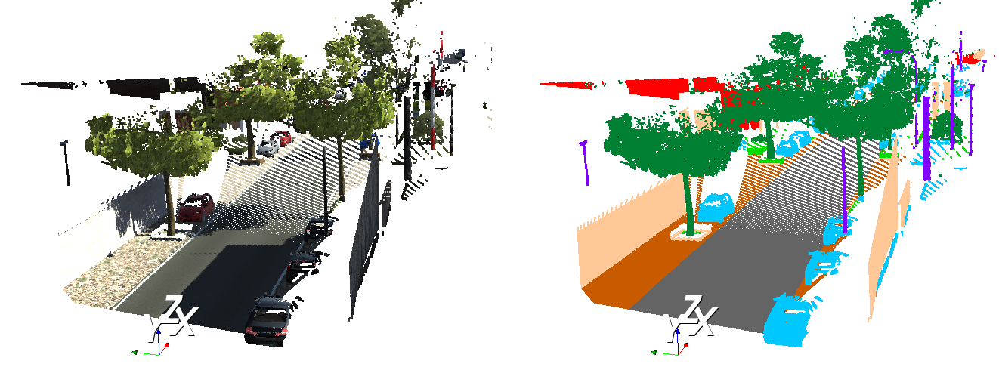

## VKITTI 3D Semantic Segmentation Dataset



This is the outdoor dataset used to evaluate 3D semantic segmentation of point clouds in ([Engelmann et al. ICCV'W17](https://www.vision.rwth-aachen.de/page/3dsemseg)) **Exploring Spatial Context for 3D Semantic Segmentation of Point Clouds** paper.
The dataset is directly derived from the [Virtual KITTI Dataset](http://www.europe.naverlabs.com/Research/Computer-Vision/Proxy-Virtual-Worlds) (v.1.3.1).

All files are provided here for convenience only, you can generate the whole dataset yourself from the original Virtual KITTI Dataset.

### Download
[VKITTI3D Dataset v1.0](https://www.vision.rwth-aachen.de/media/resource_files/vkitti3d_dataset_v1.0.zip)

### Data Format
All files are provided as numpy ```.npy``` files.
Each file contains a ```N x F``` matrix, where ```N``` is the number of points in a scene and ```F``` is the number of features per point, in this case ```F=7```.
The features are ```XYZRGBL```, the 3D ```XYZ``` position, the ```RGB``` color and the ground truth semantic label ```L```. 
You can load them as follows:
```python
import numpy as np
point_cloud = np.load('dataset/01/0001_00000.npy')  # shape: (401326, 7)
```

| Label ID | Semantics  | RGB             | Color       |
|----------|------------|-----------------|-------------|
| 0  | Terrain          | [200, 90, 0]    | brown       |
| 1  | Tree             | [0, 128, 50]    | dark green  |
| 2  | Vegetation       | [0, 220, 0]     | bright green|
| 3  | Building         | [255, 0, 0]     | red         |
| 4  | Road             | [100, 100, 100] | dark gray   |
| 5  | GuardRail        | [200, 200, 200] | bright gray |
| 6  | TrafficSign      | [255, 0, 255]   | pink        |
| 7  | TrafficLight     | [255, 255, 0]   | yellow      |
| 8  | Pole             | [128, 0, 255]   | violet      |
| 9  | Misc             | [255, 200, 150] | skin        |
| 10 | Truck            | [0, 128, 255]   | dark blue   |
| 11 | Car              | [0, 200, 255]   | bright blue |
| 12 | Van              | [255, 128, 0]   | orange      |
| *13* | *Don't care*       | *[0, 0, 0]*      | *black*      |

### Training and Evaluation
We trained our models using 6-fold cross validation as advertised in [Qi et al.](https://arxiv.org/pdf/1612.00593.pdf) (PointNet). For example, you train your model using sequences 2-5 and evaluate on 1. You then do this for all six sequences and average your numbers of all six splits.
We report the mean intersection over union (IoU), overall accuracy (over all points) and the average class accuracy.

### Tools
To visualize the point clouds:

* Install [anaconda or miniconda](https://conda.io/docs/user-guide/install/index.html)
* ```conda create --name vkitti3d python=3.6```
* ```source activate vkitti3d```
* ```conda install numpy```
* ```conda install -c clinicalgraphics vtk```

After installation you can visualize the original RGB point cloud and the corresponding semantic labels:

```cd tools```
```python visualize.py```

### Dataset Generation
How was this dataset generated?
We split up the original sequences of Virutal KITTI into non-overlapping sub-sequences to perform 6-fold cross validation.
For each sub-sequence, we selected 15 scenes/frames at equidistant timesteps to avoid overlapping data.

| Original | Ours | Train/Test Frames - VKITTI |
|---|---|---|
|  1  | 1 |     0 - 170: 0,12,24,36,48,60,72,85,97,109,121,133,145,157, 170 |
|  1  | 2 | 230 - 420: 230,243,257,270,284,297,311,325,338,352,365,379,392,406,420 |
|  2  | 3 |     0 - 232: 0,15,31,47,63,79,95,111,127,143,159,175,191,207,223 |
| 18 | 4 |   30 - 338 30,52,74,96,118,140,162,184,206,228,250,272,294,316,338 |
| 20 | 5 |   80 - 444: 80,106,132,158,184,210,236,262,288,314,340,366,392,418,444 |
| 20 | 6 | 500 - 800: 500,521,542,564,585,607,628,650,671,692,714,735,757,778,800 |

#### TODOs
* Add tools to generate data
